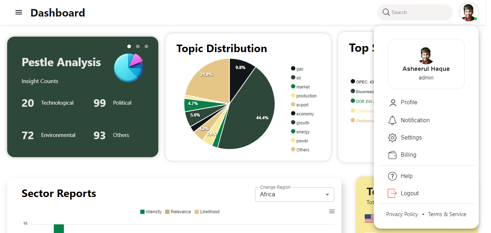

# Dynamic Data Visualization Dashboard

This repository contains a dynamic data visualization dashboard built using the MERN stack (MongoDB, Express, React, Node.js) along with ApexCharts and Material-UI. Interactive and visually appealing charts and visuals based on the data.

## Table of Contents

- [Introduction](#introduction)
- [Features](#features)
- [Technologies Used](#technologies-used)
- [Preview](#Preview)

## Introduction

Data visualization is an essential part of data analysis, and this project aims to simplify the process of creating dynamic and informative data visualizations. It uses ApexCharts, a highly customizable charting library, along with a MongoDB database to store and retrieve data.

## Features

- Dynamic data visualization using ApexCharts.
- Data stored and retrieved from a MongoDB database.
- Interactive dashboard built with Material-UI.
- Scalable and modular MERN stack architecture.
- Easily extensible for custom data sources and chart types.

## Technologies Used

- Node.js
- MongoDB
- React.js
- Material-UI
- Express.js
- ApexCharts

## Preview

